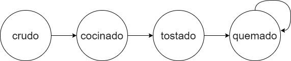
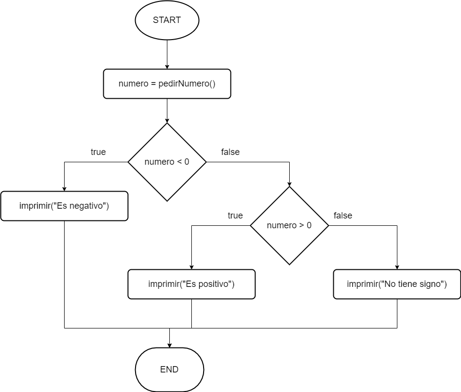
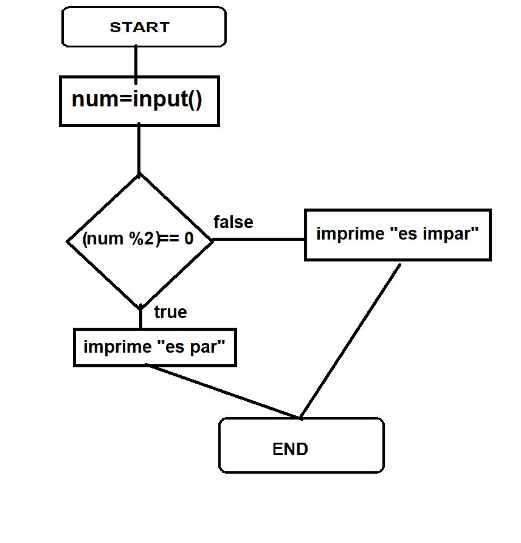
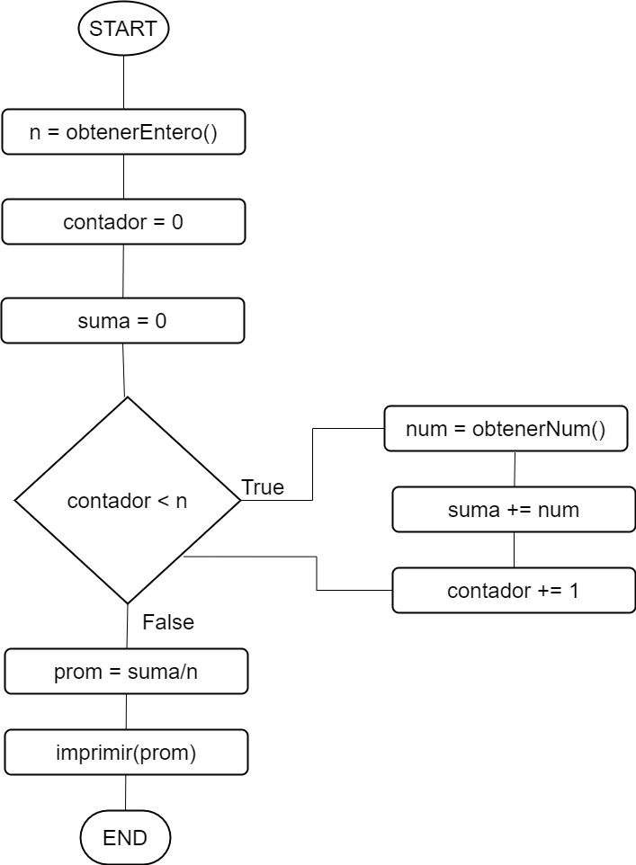
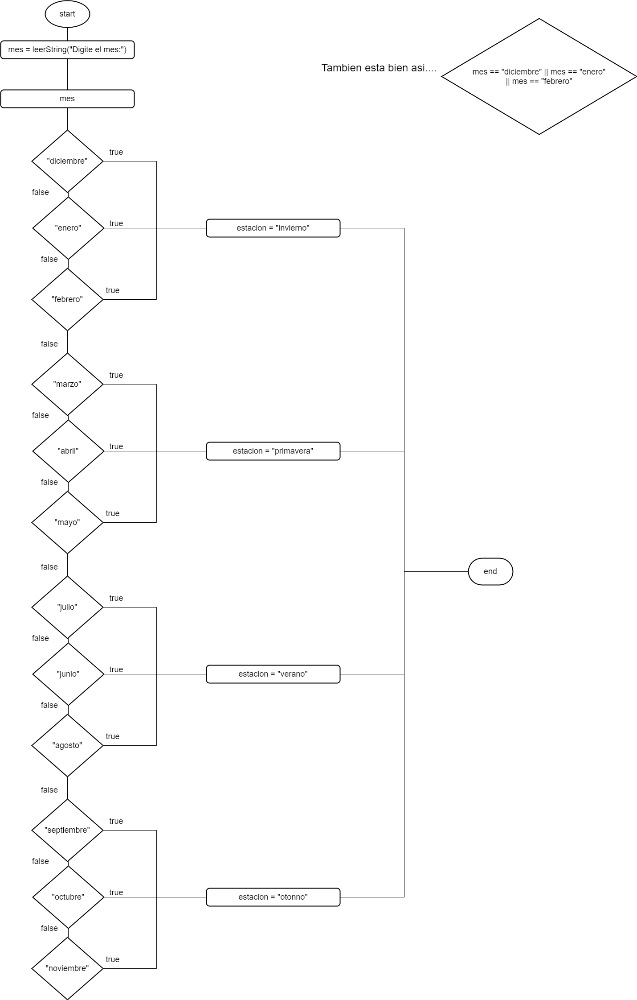

# Estructuras de control

**Presentaciones:**

- [Condicionales](https://github.com/sivanahamer/programacion-1/blob/main/05-Control/pres/08-Condicionales.pdf)
- [Ciclos](https://github.com/sivanahamer/programacion-1/blob/main/05-Control/pres/09-Ciclos.pdf)

Nuestros programas anteriores siempre siguen el mismo flujo. Es decir, si se tiene el siguiente método de `cocinar`, todo lo que tiene el cuerpo de la función se va a ejecutar. En este caso sería `this.estaCocinado = true;`.

```java
class Pizza { //Esto es la clase
    //...

    /**
    * Cocina la pizza
    */
    public void cocinar(){
        //Asumimos que no se cocina una pizza ya cocinada, aunque podría pasar :c
        this.estaCocinado = true;
    }
    //...
}
```

Dado que como en el caso anterior, podemos querer que no se siga el mismo flujo. Para ello, existen las instrucciones de **flujo de control**.

## Condicionales

Si queremos que se ejecute cierto código en ciertas condiciones, podemos crear una condición que determina si sucedió algo o no y ejecutar el código correspondiente. Esto se hace por medio de las instrucciones `if`, `else` y `switch`

Para los siguientes ejemplos, vamos a cambiar que el atributo de `estaCocinado` ya no sea un booleano. Ahora, va a guardar un `estado` como un string. El código relevante de la clase `Pizza` funciona de la siguiente manera.

```java
class Pizza { //Esto es la clase 🍕

    //Atributos
    private String topping;
    private int cantidadTajadas;
    private String estado;
    private boolean tieneQuesoEnCorteza;
  
    //Constructor
    /**
    * Crea una pizza con su información básica
    * @param topping El topping de la Pizza
    * @param cantidadTajadas La cantidad de tajadas en que se va a cortar la pizza
    * @param tieneQuesoEnCorteza Un booleano que indica si tiene o no queso en la corteza de la pizza
    */
    public Pizza(String topping, int cantidadTajadas, boolean tieneQuesoEnCorteza){
        this.topping = topping;
        this.cantidadTajadas = cantidadTajadas;
        this.tieneQuesoEnCorteza = tieneQuesoEnCorteza;
        this.estado = "crudo";
    }

    //Metodos
    /**
    * Cocina la pizza
    */
    public void cocinar(){
        //Asumimos que no se cocina una pizza ya cocinada, aunque podría pasar :c
        this.estado = "cocinado";
    }

    //..
}
```

Ahora, queremos revisar que no estamos cocinando una pizza ya se encuentra cocinada. Es decir, solo cocinamos pizzas crudas. Podemos verificar esto utilizando un `if` que compara que el `estado` de la pizza es igual a `"crudo"`. Si es así, significa que si podemos cocinarla.

```java
class Pizza { //Esto es la clase 🍕
    //...

    /**
    * Cocina la pizza
    */
    public void cocinar(){
        //Revisamos si esta cruda la pizza
        if (this.estado == "crudo"){
            this.estado = "cocinado";
        }
    }

    //...
}
```

Nótese que ahora hay veces que no se ejecuta la línea `this.estado = "cocinado";`. **Solo** se ejecuta cuando `this.estado == "crudo"`.

> [!ATTENTION]
> Cuando se comparan strings, no son iguales si hay diferencias entre mayúsculas y minúsculas.

Si bien cuando alguien vuelve a cocinar una pizza, no pasa nada en el código anterior, sabemos que si se vuelve a cocinar algo debería cambiar de estado. Por lo tanto, podemos utilizar un `else` que se ejecuta cuando no entra en la condición inicial de `this.estado == "crudo"`. Vamos a definir que una pizza que se cocina dos veces queda un estado de `"tostado"`.

```java
class Pizza { //Esto es la clase 🍕
    //...

    /**
    * Cocina la pizza
    */
    public void cocinar(){
        //Revisamos si esta cruda la pizza
        if (this.estado == "crudo"){
            this.estado = "cocinado";
        }
        //Si no, ahora queda tostado
        else {
            this.estado = "tostado";
        }
    }

    //...
}
```

Incluso, se puede agregar una condición dentro de otra condición. En nuestro ejemplo, esto sirve para representar si una pizza en estado `"tostado"` se vuelva a cocinar ahora va a estar `"quemado"`.

> [!NOTE]
> Todos los estados que suceden dentro del método `cocinar` salen en el siguiente gráfico.
> 

```java
class Pizza { //Esto es la clase 🍕
    //...

    /**
    * Cocina la pizza
    */
    public void cocinar(){
        //Revisamos si esta cruda la pizza
        if (this.estado == "crudo"){
            this.estado = "cocinado";
        }
        else {
            //Revisamos si estaba cocinado
            if (this.estado == "cocinado"){
                this.estado = "tostado";
            }
            //Solo puede ser tostado o quemado, entonces ahora la pizza queda quemada
            else {
                this.estado = "quemado";
            }
        }
    }

    //...
}
```

Como estamos comparando valores de una variable, podemos utilizar un `switch` para simplificar algo el código. Dentro de los paréntesis especificamos la variable a comparar y luego creamos un `case` para cada valor que se quiere comparar. Si se cumple el caso, entra a ejecutar al código hasta llegar a un `break`. La opción `default` dentro de un `switch` es la que se ejecuta por defecto si no funciona ningún caso.

```java
class Pizza { //Esto es la clase 🍕
    //...

    /**
    * Cocina la pizza
    */
    public void cocinar(){
        switch(this.estado){
            case "crudo":
                this.estado = "cocinado";
                break;
            case "cocinado":
                this.estado = "tostado";
                break;
            //Caso default es cualquier otro estado que va a quemado
            default:
                this.estado = "quemado";
                //La ultima opcion no ocupa un break
        }
    }

    //...
}
```

Si tenemos una variable que tiene constantes predefinidos (e.g., dias de la semana o meses), es mejor utilizar un [Enum Type](https://docs.oracle.com/javase/tutorial/java/javaOO/enum.html). Por ejemplo, se puede crear un enum para los estados de la Pizza.

```java
public enum PizzaEstado {
    CRUDO, COCINADO, TOSTADO, QUEMADO
}
```

Luego, en la clase `Pizza` luego de importar `PizzaEstado` tenemos el siguiente código modificado de la clase.

```java
class Pizza { //Esto es la clase 🍕

    //Atributos
    private String topping;
    private int cantidadTajadas;
    private PizzaEstado estado;
    private boolean tieneQuesoEnCorteza;
  
    //Constructor
    /**
    * Crea una pizza con su información básica
    * @param topping El topping de la Pizza
    * @param cantidadTajadas La cantidad de tajadas en que se va a cortar la pizza
    * @param tieneQuesoEnCorteza Un booleano que indica si tiene o no queso en la corteza de la pizza
    */
    public Pizza(String topping, int cantidadTajadas, boolean tieneQuesoEnCorteza){
        this.topping = topping;
        this.cantidadTajadas = cantidadTajadas;
        this.tieneQuesoEnCorteza = tieneQuesoEnCorteza;
        this.estado = PizzaEstado.CRUDO;
    }

    /**
    * Cocina la pizza
    */
    public void cocinar(){
        switch(this.estado){
            case PizzaEstado.CRUDO:
                this.estado = PizzaEstado.COCINADO;
                break;
            case PizzaEstado.COCINADO:
                this.estado = PizzaEstado.TOSTADO;
                break;
            //Caso default es cualquier otro estado que va a quemado
            default:
                this.estado = PizzaEstado.QUEMADO;
                //La ultima opcion no ocupa un break
        }
    }

    //...
}
```

## Ciclos

Si yo quisiera cocinar mi Pizza para que quede tostada, tendría que invocar dos veces el método `cocinar`. Vamos a asumir para el siguiente ejemplo que tenemos una instancia de la clase `Pizza` llamada `pizza`.

```java
pizza.cocinar();
pizza.cocinar();
```

Si más bien, ahora ocupamos que quede ultra quemada la pizza, ocupamos llamar un mínimo de cuatro veces el método `cocinar`. Podemos notar que existe codigo **duplicado**. **Siempre que duplicamos código es una mala práctica** de programación dado que tenemos que propagar los cambios en todas las líneas duplicadas (menos *mantenible*), hace que el código sea menos sencillo de entender (menos *legible*) y hay más riesgo a que se introduzcan repetidamente defectos (más *buggy*).

Por lo tanto, ocupamos una manera de que si ocupamos ejecutar algo varias veces se pueda hacer sin duplicar código y para ello están los **ciclos**. Los ciclos nos permiten volver a ejecutar bloque de código. Sus partes son:

1. **Inicializar:** Se inicializan las variables de iteración.
2. **Evaluar:** Se evalúa la condición de parada para determinar se sigue el ciclo
3. **Actualizar:** Se actualizan
las variables de iteración.

Hay dos instrucciones para realizar ciclos: `while` y `for`. Para el siguiente ejemplo, vamos a crear un método llamado `cocinarPizzaVariasVeces` que va a encargarse de cocinar una `pizza` la cantidad de veces que tiene de valor `veces`. En el método `ordenarPizza` se agrega un parámetro con las veces que se ordenó que se cocinara la pizza y se cambió la invocación al método de `cocinarPizzaVariasVeces`.

```java
class Pizzeria {
    //...
    //Metodos...
 
    /**
    * Cocina una pizza varias veces
    * @param pizza La pizza a cocinar
    * @param topping El topping de la Pizza
    */
    public void cocinarPizzaVariasVeces(Pizza pizza, int veces){
        //...
    }

    /**
    * Se encarga de ordenar una pizza
    * @param topping El topping de la Pizza
    * @param cantidadTajadas La cantidad de tajadas en que se va a cortar la pizza
    * @param tieneQuesoEnCorteza Un booleano que indica si tiene o no queso en la corteza de la pizza
    * @param veces Las veces en que se va a cocinar la pizza
    * @return La pizza que se ordenó
    */
    public Pizza ordenarPizza(String topping, int cantidadTajadas, boolean tieneQuesoEnCorteza, int veces){
        //Primero creamos la pizza que se va a ordenar
        Pizza pizza = new Pizza(topping, cantidadTajadas, tieneQuesoEnCorteza);
 
        //Se cocina la pizza basado en la orden
        this.cocinarVariasVeces(pizza, veces);
 
        //Devolvemos la pizza que se ordenó
        return pizza;
    }
 
    //...
}
```

Ahora, vamos a agregar un ciclo dentro del método `cocinarPizzaVariasVeces` por medio del while. Nótese que aquí nuestra variable de iteración es `cocinadas` que guarda cuantas veces se cocine la pizza ya hasta llegar al límite indicado en `veces`.

```java
class Pizzeria {
    //...
    //Metodos...
 
    /**
    * Cocina una pizza varias veces
    * @param pizza La pizza a cocinar
    * @param topping El topping de la Pizza
    */
    public void cocinarPizzaVariasVeces(Pizza pizza, int veces){
        int cocinadas = 0; //Inicializar
        while (cocinadas < veces){ //Evaluar
            pizza.cocinar();
            cocinadas++; //Actualizar
        }
    }
}
```

Igualmente, se puede hacer con un `for` de la siguiente manera:

```java
class Pizzeria {
    //...
    //Metodos...
 
    /**
    * Cocina una pizza varias veces
    * @param pizza La pizza a cocinar
    * @param topping El topping de la Pizza
    */
    public void cocinarPizzaVariasVeces(Pizza pizza, int veces){
        for (int cocinadas = 0; cocinadas < veces; cocinadas++){ //Todo en un paso
            pizza.cocinar();
        }
    }
}
```

> [!NOTE]
> Se puede usar un `while` siempre que se usa un `for` y viceversa ya que hacen el mismo ciclo.
> Yo si recomiendo como buena práctica utilizar un `while` cuando no se sabe cuántas iteraciones se van a realizar (pidiendo un dato de una persona usuaria). Mientras que un `for` debería usarse cuando se sabe la cantidad de iteraciones.

## Ejercicios

### Signo y par 🔢

> 
> 

[numero](https://raw.githubusercontent.com/sivanahamer/programacion-1/main/05-Control/src/numero/Numero.java ':include :type=code text')

[numeroMain](https://raw.githubusercontent.com/sivanahamer/programacion-1/main/05-Control/src/numero/Main.java ':include :type=code text')

### Promedio ➗

> 

[promedio](https://raw.githubusercontent.com/sivanahamer/programacion-1/main/05-Control/src/promedio/Main.java ':include :type=code text')

### Estaciones 🏂🏿🌱☀️🎃

> 

[mes](https://raw.githubusercontent.com/sivanahamer/programacion-1/main/05-Control/src/estaciones/Mes.java ':include :type=code text')

[estacionesMain](https://raw.githubusercontent.com/sivanahamer/programacion-1/main/05-Control/src/estaciones/Main.java ':include :type=code text')

## Material suplemental

Se recomienda ver los siguientes materiales para repasar el contenido visto en clases.

### Videos

- [Secuencias, selecciones y ciclos](https://youtu.be/eSYeHlwDCNA).
- [Instrucción if](https://youtu.be/iMeaovDbgkQ).
- [Ciclo while](https://youtu.be/8ZuWD2CBjgs).
- [Ciclo for](https://youtu.be/rjkYAs6gAkk).

### Lecturas

- Capítulo 3. Eck, David. Introduction to Programming Using Java. Octava edición. 2015.
- Capítulos 5 y 6. Downey, Allen y Mayfield, Chris. Think Java: How to Think Like a Computer Scientist. Segunda edición. O’Reilly Media. 2019.
