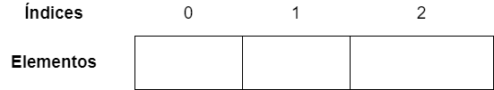
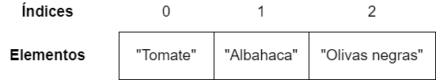
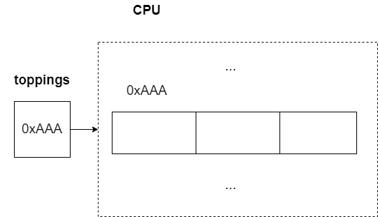

# Arreglos
 
**Presentaciones:**
 
- [Arreglos](https://github.com/sivanahamer/programacion-1/blob/main/06-Arreglos/pres/10-Arrays.pdf)
 
**Asignación:** Pendiente.
 
En nuestras variables anteriores, siempre que queremos guardar algo teniamos que crear una variable para ello. Por ejemplo, dentro de nuestra clase `Pizza` tenemos un atributo que representa un `topping`.
 
```java
class Pizza { //Esto es la clase 🍕
 
    //Atributos
    //...
    private String topping;
    //...
}
```
 
Si yo quisiera que la pizza tenga dos toppings, tendría que crear otra variable.
 
```java
class Pizza { //Esto es la clase 🍕
 
    //Atributos
    //...
    private String topping1;
    private String topping2;
    //...
}
```
 
De esta manera, tendríamos un `topping1` y un `topping2`. Si siguiéramos agregando una nueva variable para cada nuevo topping, con $n$ toppings en total, nos quedaria el siguiente código.
 
```java
class Pizza { //Esto es la clase 🍕
 
    //Atributos
    //...
    private String topping1;
    private String topping2;
    private String topping3;
    //...
    private String toppingN;
    //...
}
```
 
Como podemos ver hay varios problemas:
 
- El código esta **duplicado**, ya que estamos copiando y pegando la misma definición de la variable $n$ veces. Esto reduce la **mantenibilidad**, dado que si hago un cambio en una variable (por ejemplo el tipo de dato), se tiene que cambiar todo el resto. Si hubiera un defecto en el código, igual se duplicaría en varias partes.
- Es poco **robusto** el código, debido a que solo acepta que se tengan dos toppings. Pero, podría suceder que un usuario quiera menos o más toppings. Por ejemplo, alguien podría pedir una pizza sin nada, una pizza solo con piña, una pizza con tomate y olivas, o una suprema que tiene muchos toppings. Por lo tanto, la cantidad puede variar.
 
Por lo mismo requerimos **colecciones** de objetos. Existen muchas maneras en que se pueden guardar grupos de objetos en lenguajes de programación, particularmente por medio de distintas **estructuras de datos**. Cada una con sus propiedas. Vamos a iniciar viendo un **arreglo**, que guarda valores llamados **elementos** en una secuencia. Cada elemento puede ser accedido por medio de un **indice**. La estructura de un arreglo vacío de 3 elementos se ve de la siguiente manera:
 

 
Para utilizar un arreglo de `toppings` modificamos la clase de esta manera.
 
```java
class Pizza { //Esto es la clase 🍕
 
    //Atributos
    //...
    private String [] toppings;
    //...
}
```
 
Mientras que cuando instalamos los toppings en algun lado del codigo, se hace asi.
 
```java
//...
toppings = new String [3];
//...
```
 
Aqui estamos indicando que queremos crear 3 toppings. Para agregar valores a los toppings, tenemos que **acceder** a los elementos por los índices. Para ello, usamos `toppings[i]`, donde $i$ es el indice del arreglo donde queremos agregar el topping. Si agregamos a `"Tomate"`, `"Albahaca"` y `"Olivas negras"` se hace de la siguiente manera.
 
```java
//...
toppings[0] = "Tomate";
toppings[1] = "Albahaca";
toppings[2] = "Olivas negras";
//...
```

Dado estos accesos, modifcamos el arreglo para que quede de la siguiente manera.



En un caso que ya sabemos que queremos arreglar desde el inicio, podemos indicarlo por medio de llaves.

```java
//...
toppings = {"Tomate", "Albahaca", "Olivas negras"};
//...
```

Dado que puede variar durante la ejecución del programa el tamaño del arreglo (por ejemplo si un usuario indica el tamaño), no se puede pedir espacio para guardar la variable hasta que esté en ejecución el programa. Por lo tanto, se requiere de **memoria dinámica** que se pide al procesador, que da una **dirección de memoria** donde se van a guardar los elementos del arreglo. Por lo mismo, en la variable del arreglo se guarda la dirección de memoria y no los elementos. Esto se ve de la siguiente manera:



> [!NOTE]
> Los índices inician desde cero, ya que los arreglos se guardan en posiciones de memoría. Formalmente, los arreglos guardan de valor una dirección de memoria $x$ con elementos de $b$ bytes. Si se quiere acceder al elemento con indice $i$ se utiliza la siguiente formula:
> $$ x + b * i$$
> Por lo tanto, en el caso de $i=0$, queda solamente la direccion de memoria $x$ . Por lo mismo para no desperdiciar espacio y no tener que realizar operaciones matematematicas inecesarias, el primer elemento se guarda en esta posicion.


<!-- ARRAY FOR A RESTAURANT SEETING TO DETERMINE IF THERE IS A SPACE OR NOT FOR THE PIZZA. -->
